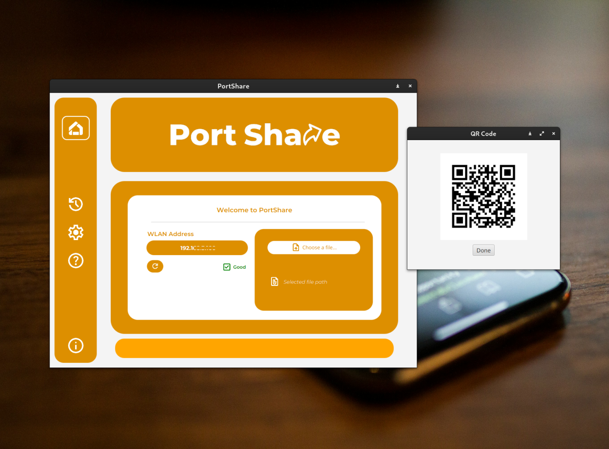

# PortShare

PortShare is a lightweight file-sharing application that allows users to transfer files from their desktop to mobile devices over a local network. The application generates a QR code for easy file access on mobile devices, eliminating the need for USB cables, cloud platforms, or third-party apps. It is designed with simplicity and convenience in mind, enabling users to share files seamlessly over a wireless network.

## Features

- **File Transfer over WLAN:** Share files with any device connected to the same local network.
- **QR Code for Easy Access:** Automatically generate a QR code for the file link, which can be scanned using a mobile device.
- **Minimal Setup:** No need for external cables or cloud-based platforms.
- **Cross-Platform:** Built using Java and JavaFX, it runs on multiple platforms (Windows, macOS, Linux).
- **Simple UI:** Easy-to-use interface with clear navigation and real-time feedback.
  
## How It Works

1. Choose a file from your desktop.
2. PortShare generates a QR code.
3. Scan the QR code with any mobile device connected to the same WLAN.
4. Download the file directly to your device.

## Installation

### Requirements

- **Java 22 or higher**
- **JavaFX**
- **Maven** (for building the project)

### Usage
- Select a file using the "Choose File" button.
- The app will display the file path and enable the "Share" button.
- When you click "Share", a QR code will be generated with a link to download the file.
- Scan the QR code using any mobile device connected to the same WLAN to download the file.

### Technologies Used
- **Java 22**
- **JavaFX (for GUI)**
- **ZXing** (for QR code generation)

### Contributions
Contributions, issues, and feature requests are welcome!

- Fork the project.
- Create a feature branch: git checkout -b feature/AmazingFeature.
- Commit your changes: git commit -m 'Add some amazing feature'.
- Push to the branch: git push origin feature/AmazingFeature.
- Open a pull request.
